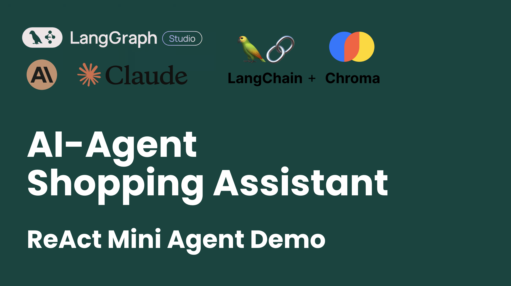
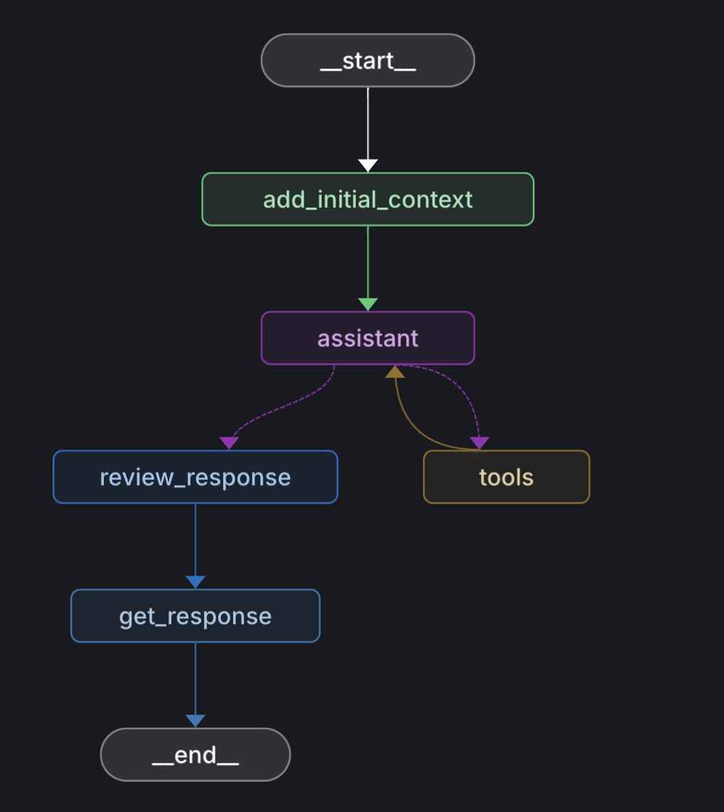

# AI-agent shopping assistant

## Overview
This is a shopping assistant built with LangGraph and LangChain. The underlying idea is to build a ReAct agent with RAG functionality. It can answer questions about the products and the company and give product recommendations. I use [Shokz Canada](https://ca.shokz.com/) store as an example to build the agent.

🎥 **Watch the Demo on YouTube:**

[](https://www.youtube.com/watch?v=FH_ebnMP9WE)

## Workflow


## Features
- Give smart product recommendations based on the user's search query
- Give factual information about the company and the products
- Give comparison between products

## Setup

### Create an environment and install dependencies
`python3.11` is recommended.
#### Mac/Linux/WSL
```
$ python3 -m venv venv
$ . venv/bin/activate
$ pip install -r requirements.txt
```

### Setting up env variables
Create a `.env` file under the `studio` directory with the following:

### Set ANTHROPIC API key
*  Set `ANTHROPIC_API_KEY` in your `.env` file 

### Sign up and Set LangSmith API
* Sign up for LangSmith [here](https://smith.langchain.com/), find out more about LangSmith
* and how to use it within your workflow [here](https://www.langchain.com/langsmith), and relevant library [docs](https://docs.smith.langchain.com/)!
*  Set `LANGCHAIN_API_KEY`, `LANGCHAIN_TRACING_V2=true` in your environment 

### Set up LangGraph Studio

* Currently, Studio only has macOS support and needs Docker Desktop running.
* Download the latest `.dmg` file [here](https://github.com/langchain-ai/langgraph-studio?tab=readme-ov-file#download)
* Install Docker desktop for Mac [here](https://docs.docker.com/engine/install/)

### Create vector database
```
$ cd studio/data
$ python load_products.py
$ python load_others.py
```

### Run the assistant
open langgraph studio and run the assistant

---
## References
1. LangChain RAG pipeline tutorial: https://python.langchain.com/docs/tutorials/rag/
2. ChromaDB quickstart tutorial: https://github.com/johnnycode8/chromadb_quickstart
3. A good tutorial for build a RAG and web search agent: https://medium.com/the-ai-forum/build-a-reliable-rag-agent-using-langgraph-2694d55995cd